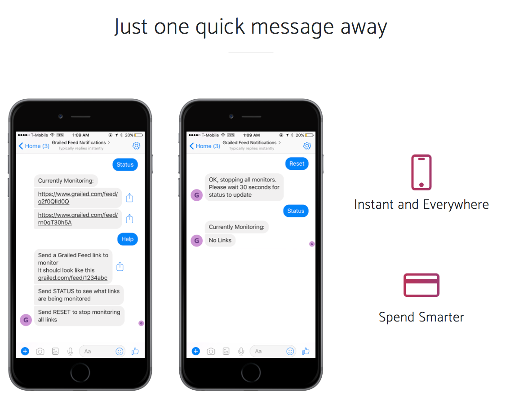

# Grailed Facebook Chatbot

Facebook Chat Bot that monitors Graled.com Feed Links and sends notifications for new listings

Product Website: https://rahulbatra.me/grailed/website/

Facebook Page: https://www.facebook.com/Grailed-Feed-Notifications-542587252773234/


## Getting Started

These instructions will get you a copy of the project up and running on your local machine for development and testing purposes. See deployment for notes on how to deploy the project on a live system.

### Prerequisites

What things you need to install the software and how to install them

```
Python
Redis 

```

### Installing

A step by step series of examples that tell you how to get a development env running

Say what the step will be

```
Give the example
```

And repeat

```
until finished
```

End with an example of getting some data out of the system or using it for a little demo


## Deployment

Add additional notes about how to deploy this on a live system

## Built With

* [Flask](http://flask.pocoo.org) - Micro web framework to create and run app server
* [Redis](https://redis.io) - Databased used to store links and items
* [Selenium](https://github.com/SeleniumHQ/selenium) - Used to simulate browser and access webpages
* [BeautifulSoup](https://www.crummy.com/software/BeautifulSoup/) - Used to scrape data from HTML
* [Heroku](https://www.heroku.com/) - Cloud application hosting

## Versioning

We use [SemVer](http://semver.org/) for versioning.

## Authors

* **Rahul Batra** 

See also the list of [contributors](https://github.com/Spyruf/Grailed-Facebook-Chatbot/contributors) who participated in this project.

## License

This project is licensed under the GPL-3.0 License - see the [LICENSE.md](LICENSE.md) file for details


# --------------------------------------------------------------------------------------------------------------------
# Grailed-Push-Notifications
### View website here: https://rahulbatra.me/grailed/website/

Facebook Chat Bot that monitors Graled.com Feed Links and sends notifications for new listings

Facebook Page Link: https://www.facebook.com/Grailed-Feed-Notifications-542587252773234/





### Supported Inputs
#### 1. Grailed Feed Links
  - e.g  https://www.grailed.com/feed/1234abc

#### 2. Status
  - Shows all current links being monitored

#### 3. Reset
  - Stops monitoring any links for the current user


### Screenshots
General


New Items Format


